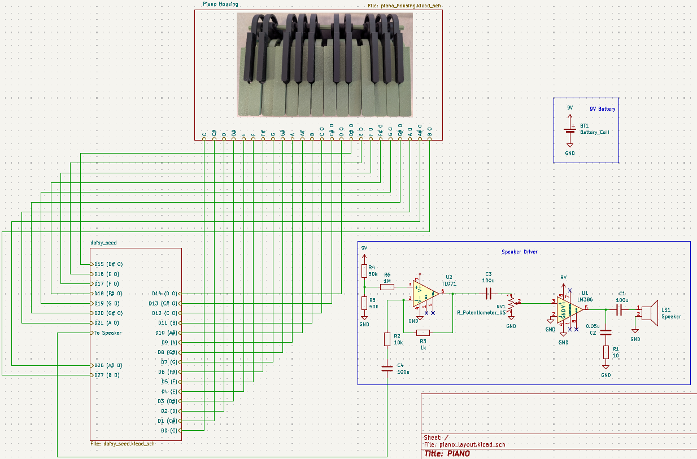
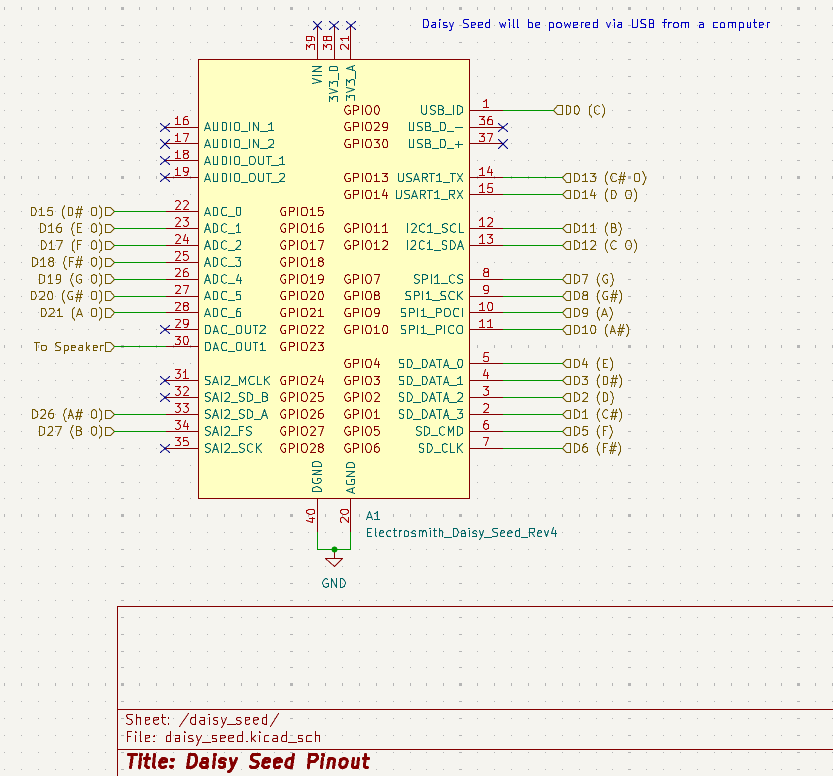
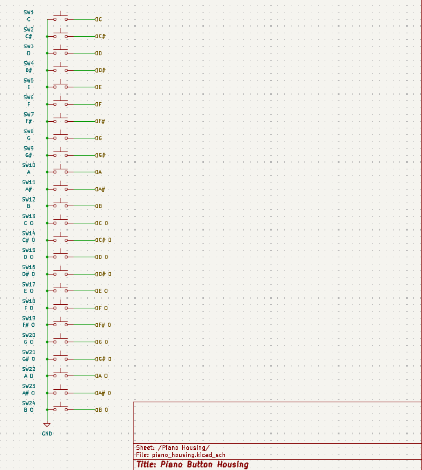

# Piano
Piano for ECE Thread Challenge

## Overview
This project attempts to recreate the sound of a piano through DSP analysis of real piano notes and reconstruction via an embedded system.

## Devices and Peripherals
1) [Daisy Seed](https://electro-smith.com/products/daisy-seed)
2) [LM386 Speaker Driver](https://www.ti.com/product/LM386)
3) [TL071 Op-Amp](https://www.ti.com/product/TL071)

## Schematic

